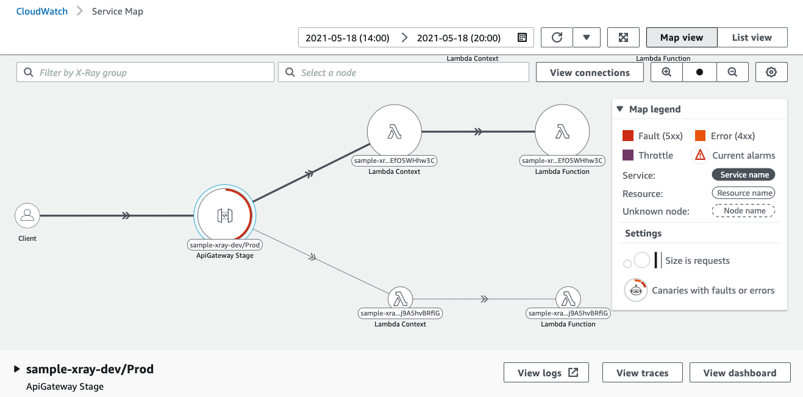
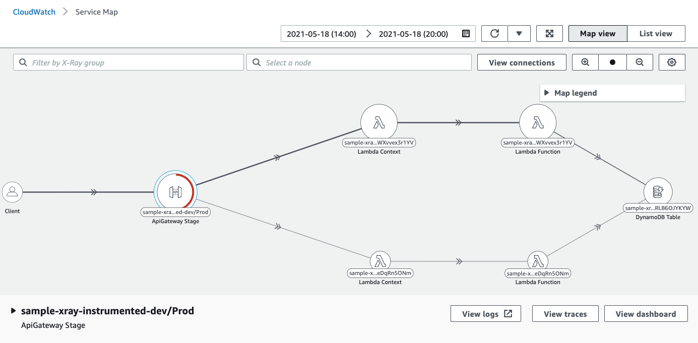

## AWS X-Ray Serverless Samples

These samples are originally pulled from AWS X-Ray Serverless Samples [here](https://github.com/aws-samples/aws-xray-serverless-samples).

The samples in this repository demonstrate different ways to integrate AWS X-Ray within a serverless application.

* **xray**: Simple tracing without code instrumentation.
* **xray-instrumented**: AWS X-Ray tracing with code instrumentation.

The **pipeline** folder contains an AWS CloudFormation template for a pipeline using AWS CodeCommit, AWS CodePipeline and AWS CodeBuild.

The **helpers** folder contains script to help deploy Serverless applications locally and run calls against API Gateway.

## Requirements


The samples require below list programs to be installed on your computer.

The **easiest way** to do this is to setup a Cloud9 environment on AWS and use it for experimentation. 
AWS Cloud9 is a cloud-based integrated development environment (IDE) that lets you write, run, and debug your code with just a browser. It includes a code editor, debugger, and terminal. Cloud9 comes prepackaged with essential tools for popular programming languages, including JavaScript, Python, PHP, and more, so you don’t need to install files or configure your development machine to start new projects.
[Getting started with AWS Cloud9](https://aws.amazon.com/cloud9/getting-started/)


Required programs :
* [AWS Command Line Interface](https://aws.amazon.com/cli/)
* [AWS SAM CLI](https://docs.aws.amazon.com/serverless-application-model/latest/developerguide/serverless-sam-cli-install.html)
* [Docker](https://docs.docker.com/install/)
* [Go](https://golang.org/dl/)
* [Python 3](https://www.python.org/downloads/)

You would also need to install the [cfn_flip](https://github.com/awslabs/aws-cfn-template-flip) package for Python3. You can install it with Pip by running `python3 -m pip install cfn_flip`.


## Usage
Once pre-requisites are installed and configured, run following :


### 1. Create IAM Role for API Gateway to send CloudWatch Logs for your API 

To enable CloudWatch Logs for all or only some of the methods, you must also specify the ARN of an IAM role that enables API Gateway to write information to CloudWatch Logs on behalf of your IAM user. This is one time activity. If you have done this, skip to next step.

- Sign in to the IAM console at https://console.aws.amazon.com/iam.

- In the navgation pane, choose **Roles**, and then click on **Create Role** button.

- Under **Select type of trusted entity**, Choose **API Gateway** under section 'Or select a service to view its use cases'.

This should automatically attach the managed policy of **AmazonAPIGatewayPushToCloudWatchLogs**, which contains the following access policy statement:
```
{
    "Version": "2012-10-17",
    "Statement": [
        {
            "Effect": "Allow",
            "Action": [
                "logs:CreateLogGroup",
                "logs:CreateLogStream",
                "logs:DescribeLogGroups",
                "logs:DescribeLogStreams",
                "logs:PutLogEvents",
                "logs:GetLogEvents",
                "logs:FilterLogEvents"
            ],
            "Resource": "*"
        }
    ]
}
```

  The IAM role must also contain the following trust relationship statement:

```
{
  "Version": "2012-10-17",
  "Statement": [
    {
      "Sid": "",
      "Effect": "Allow",
      "Principal": {
        "Service": "apigateway.amazonaws.com"
      },
      "Action": "sts:AssumeRole"
    }
  ]
}
```

- Follow the wizard and create the IAM Role. 

- Copy the Role's ARN which should be in format **"arn:aws:iam::<account-id>:role/<role-name>"**


### 2. Create an Amazon S3 Bucket. 
Replace <S3-bucket-name> with a valid bucket name.

```
aws s3 mb s3://<S3-bucket-name>
```

### 3. Deploy

To deploy any sample, go to the sample folder and run the following commands:

```
export S3_BUCKET="<S3-bucket-name>"
make
```

Replace <S3-bucket-name> with a valid bucket name from previous step.

### 4. Enable CloudWatch Logs for your API 

- Sign in to the API Gateway console at https://console.aws.amazon.com/apigateway.

-  Choose **Settings** from the APIs main navigation pane. Then paste the ARN of the IAM role from previous step, in the **CloudWatch log role ARN** text field.

- Back in the API Gateway Console, In the **APIs** pane, choose the API, and then choose Stages.

- In the **Stages** pane, choose the name of the stage **Prod**.

- In the **Stage Editor** pane, choose the Settings tab.

- To enable Amazon CloudWatch Logs for all of the methods associated with this stage of this API Gateway API, do the following:

    - Under the **CloudWatch Settings** section, select the **Enable CloudWatch Logs** option.    
    - For Log level, choose **INFO** to include all ERROR events, as well as extra informational events.
    -  To log full API call request and response information, select **Log full requests/responses** data. No sensitive data is logged unless the Log full requests/responses data option is selected.
    - To have API Gateway report to CloudWatch the API metrics of API calls, Latency, Integration latency, 400 errors, and 500 errors, choose the Enable Detailed CloudWatch Metrics option. For more information about CloudWatch, see the Amazon CloudWatch User Guide.
    - Choose **Save Changes**. The new settings take effect after a new deployment.
    
    

### 4. Send test traffic

To send test traffic for a particular sample, run this command in the sample folder:

```
make calls
```

By default, this will send 10 PUT requests and 500 GET requests. Run this command multiple times to send more traffic.

### 5. Check Amazon CloudWatch Service Lens

After sending test traffic, you can check traces and the service map in the [AWS Service Lens Console](https://console.aws.amazon.com/cloudwatch/home).





### 6. Cleanup

To tear down resources, run this command in the sample folder:

```
make delete
```

If you used Cloud9, then please delete the Cloud9 environment once you are done with experimentation.


## Troubleshooting

### I keep getting "socket: too many open files" errors when running "make calls"

The **get** program triggers 500 HTTP calls by default, which can exceed the default limit of open file descriptors. You can increase this limit by running `ulimit -n 4096`, which should be enough for the default case.

To learn more about this, check the ulimit help by typing `help ulimit` or the man page for `limits.conf`.

## License Summary

This sample code is made available under the MIT-0 license. See the LICENSE file.
